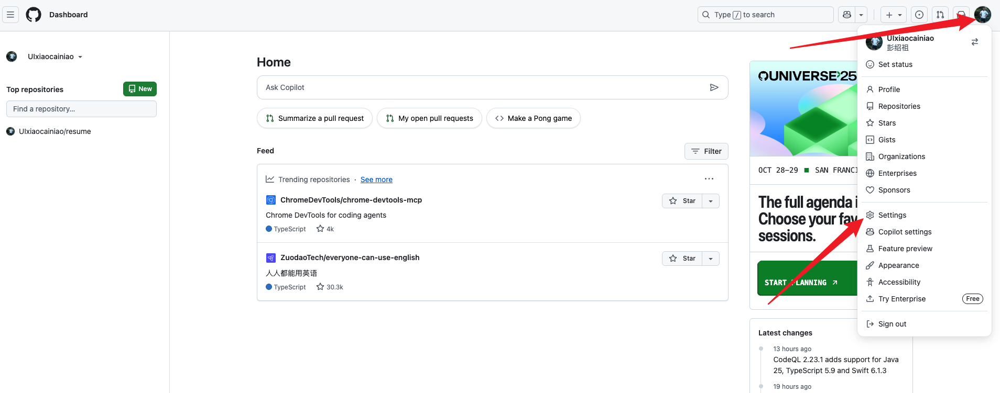
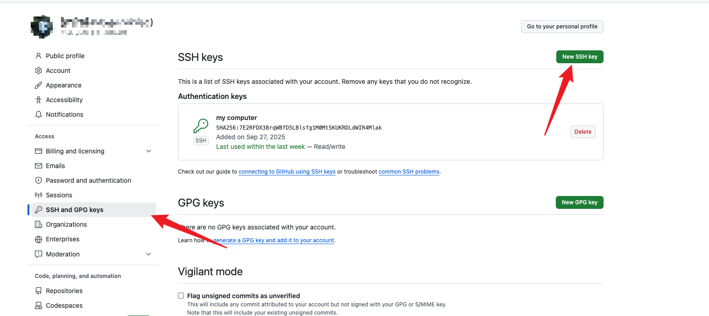
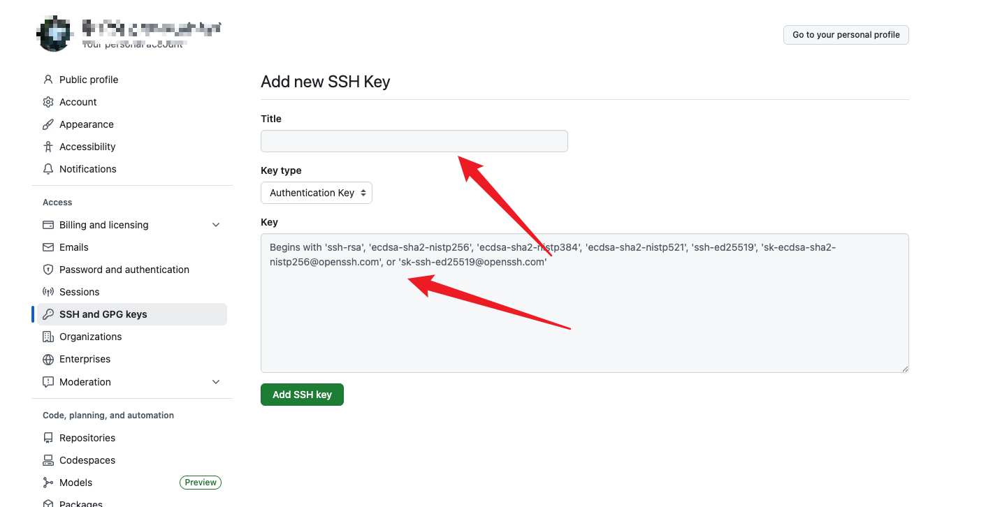

# 一. 配置本地ssh信息
1. 执行命令`ssh-keygen -o` 然后一直按回车直到结束
2.  运行`cat ~/.ssh/*.pub`文件，*是tab 补出来的，不是固定的名字，然后把在终端上显示的内容复制
3. 打开 github仓库



4. 填写 title，然后把第 2 步拿到的信息复制到key 输入框中，点击保存。


# 二. 拉取远端项目
- 打开一个命令行工具
```
cd ~
mkdir workspace
```
- 拉取远端项目
```
git clone git@github.com:UIxiaocainiao/resume.git
```
- 你本地就有一个目录叫做 resume

- 当你修改了动东西之后
```
git status # 查看仓库中的文件追踪信息
git add . # 将当前目录下的所有文件都使用 git 进行追踪
git commit -m "change somethings" # 在 git 版本管理中添加关于本次修改的信息
git push origin main # 推送到远端git仓库的 main 分支
```


123